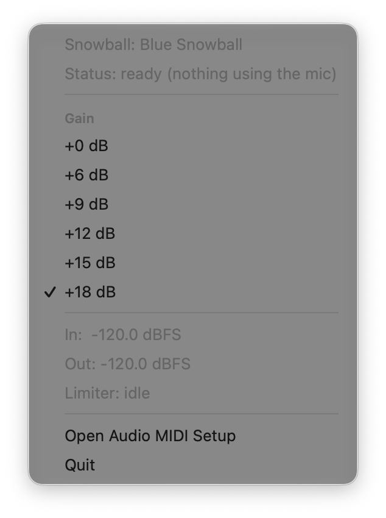
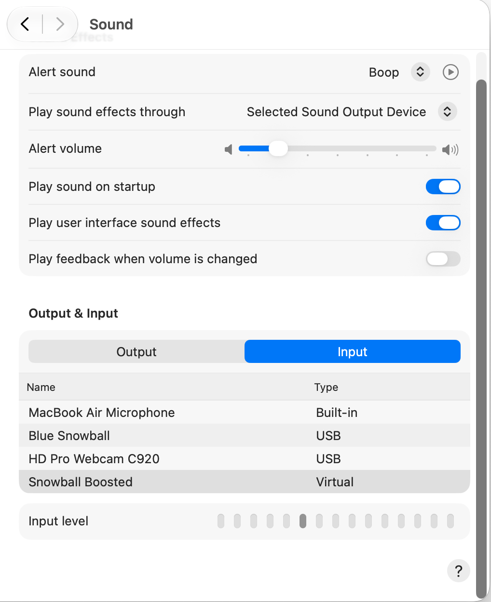

# Blue Snowball Boost — fix a quiet Blue Snowball iCE microphone on macOS

> **Status: finished and provided as-is.** This is a personal tool, shared in case it helps
> someone else with a quiet Blue Snowball. You're welcome to download it, use it, fork it, and
> change it (MIT license). It isn't maintained, and issues and pull requests won't be answered.

If your **Blue Snowball iCE sounds too quiet on Mac** — low mic volume in Zoom, Teams, or a
browser, even with the input gain slider maxed out in System Settings — this fixes it. It adds a
free virtual microphone, **"Snowball Boosted,"** that takes the Snowball's signal, applies clean
digital gain (+12 to +18 dB) and a transparent limiter so it never clips, and publishes the result
as a normal Core Audio input device any app can select — no more re-recording, no re-encoding
workaround, no separate audio interface to buy.

Free, open source (MIT), and **fully offline** — no network code, no telemetry, no third-party
dependencies. Apple frameworks and code written in this repo only. Not affiliated with, endorsed
by, or sponsored by Logitech or Blue Microphones; "Blue Snowball" is their trademark, used here
only to describe hardware compatibility.

## Screenshots

| Menu-bar app | "Snowball Boosted" in System Settings |
|---|---|
|  |  |

*(Placeholders — add the actual screenshots to `docs/images/` as `menu-bar-app.png` and
`sound-settings-input.png`.)*

## Requirements

- Apple Silicon Mac, macOS 15 or later (developed and tested on macOS 27).
- A Blue Snowball **iCE** (USB, VID `0x0D8C` / PID `0x0005`) — see the FAQ below about the
  original (non-iCE) Snowball.
- Xcode (for the Swift/Clang toolchain — no Xcode project is opened, everything builds from the
  command line). No other dependencies: no Homebrew, no CocoaPods, nothing downloaded at build time.

## Quick Start

```bash
make               # build DSP + core + driver + app + CLI, run swift test
make install       # builds again, then installs driver + app + LaunchAgent (asks for your
                    # password partway through — see "What sudo is for" below)
```

**Don't prefix `make install`/`make install-driver` with `sudo`** — the script escalates
internally only where it needs to; see [BUILD.md](BUILD.md) for why the whole command can't run as
root.

Then select **"Snowball Boosted"** as the microphone in your app of choice (or in
System Settings → Sound → Input). The first time anything actually opens it, macOS will ask
**"Snowball Boost would like to access the microphone"** — click **Allow** (this is standard
mic-permission (TCC) behavior, not anything unusual to this project).

Gain defaults to +12 dB; change it from the menu-bar app (small mic icon in the menu bar) or
`sbboost gain <0|6|9|12|15|18>`. See "Results" below for what gain to pick at what distance.

**What `sudo` is for**: only copying the driver into `/Library/Audio/Plug-Ins/HAL/` and restarting
`coreaudiod` so it loads it. Nothing else needs elevated privileges.

Full walkthrough: [INSTALL.md](INSTALL.md). Build details: [BUILD.md](BUILD.md). Uninstalling:
[UNINSTALL.md](UNINSTALL.md). Problems: [TROUBLESHOOTING.md](TROUBLESHOOTING.md).

## What's in the repo

| Path | What |
|---|---|
| `Sources/BoostDSP` | RT-safe C gain + lookahead peak limiter kernel |
| `Sources/SnowballCore` | Swift: device discovery, the boost engine, settings, meters |
| `Sources/sbboost` | CLI: `status`, `gain`, `diagnose`, `bench` |
| `Sources/SnowballBoostApp` | SwiftUI menu-bar app (gain picker, live meters) |
| `Driver/` | The `AudioServerPlugIn` C driver (`SnowballBoost.driver`) |
| `Tests/` | `swift test` — DSP math + device-matching logic |
| `scripts/` | `preflight.sh` (read-only checks), `install.sh`, `uninstall.sh` |

## Results

Measured with `sbboost bench` at +12 dB gain: raw Blue Snowball vs. "Snowball Boosted," recorded
**simultaneously** from the same speech, at a few different speaking distances.

| Distance | RMS (raw → boosted) | Peak (raw → boosted) | Clipped samples | Latency |
|---|---|---|---|---|
| 70 cm | −41.3 → −29.3 dBFS | −23.0 → −11.0 dBFS | 0 | 6.7 ms |
| 35–40 cm | −40.1 → −28.1 dBFS | −21.8 → −9.5 dBFS | 0 | 5.3 ms |
| 25 cm | −38.2 → −26.2 dBFS | −22.4 → −10.4 dBFS | 0 | 6.9 ms |

Zero clipped samples at every distance — the limiter does its job. Recommendation: **+15 dB**
around 25–30 cm, **+18 dB** around 70 cm. Tip: pointing the Snowball's logo side directly at your
mouth does more for level than turning up the gain further.

Also confirmed to recover cleanly from `coreaudiod` restarts, unplugging/replugging the Snowball,
app crashes (the LaunchAgent restarts it automatically), and sleep/wake.

## FAQ

### Why is my Blue Snowball so quiet on Mac?

The Snowball iCE's hardware input gain tops out around +10 dB, and even at maximum it's often
still too quiet at a normal ~30 cm speaking distance — this is a hardware headroom limit, not a
setting you're missing. Turning the macOS input slider all the way up doesn't add any more gain
than it already has.

### How do I increase Blue Snowball microphone volume on macOS?

Install this tool (`make && make install`, see Quick Start above) and select **"Snowball
Boosted"** — not "Blue Snowball" — as your microphone. It applies +12 to +18 dB of clean digital
gain on top of whatever the hardware already provides, with a limiter so it can't clip.

### Blue Snowball iCE low input level in Zoom / Teams / browsers — how do I fix it?

Same fix: in that app's audio/microphone settings, pick **"Snowball Boosted"** instead of "Blue
Snowball." It shows up as a normal input device everywhere Core Audio devices are listed.

### Is it safe? Do I need to disable SIP?

No SIP changes needed, and none are made. There's no kernel extension — the driver is a normal
`AudioServerPlugIn`, the same mechanism macOS itself uses for HAL audio plug-ins, loaded by
`coreaudiod` the standard way. See [ARCHITECTURE.md](ARCHITECTURE.md) for the full design
rationale and rejected alternatives.

### Does it send my audio anywhere?

No. Everything runs locally on your Mac — there is no network code anywhere in this codebase (no
`URLSession`, no sockets, nothing). Audio never leaves the machine.

### Does it work with the original (non-iCE) Blue Snowball?

Built and tested on the Blue Snowball **iCE** only (USB VID `0x0D8C` / PID `0x0005`). The original
(non-iCE) Snowball has different USB identifiers and hasn't been tested — it may or may not be
detected.

## License

[MIT](LICENSE).
